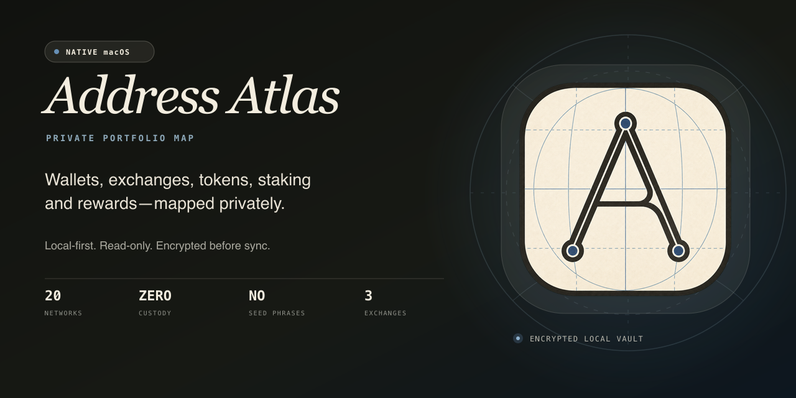
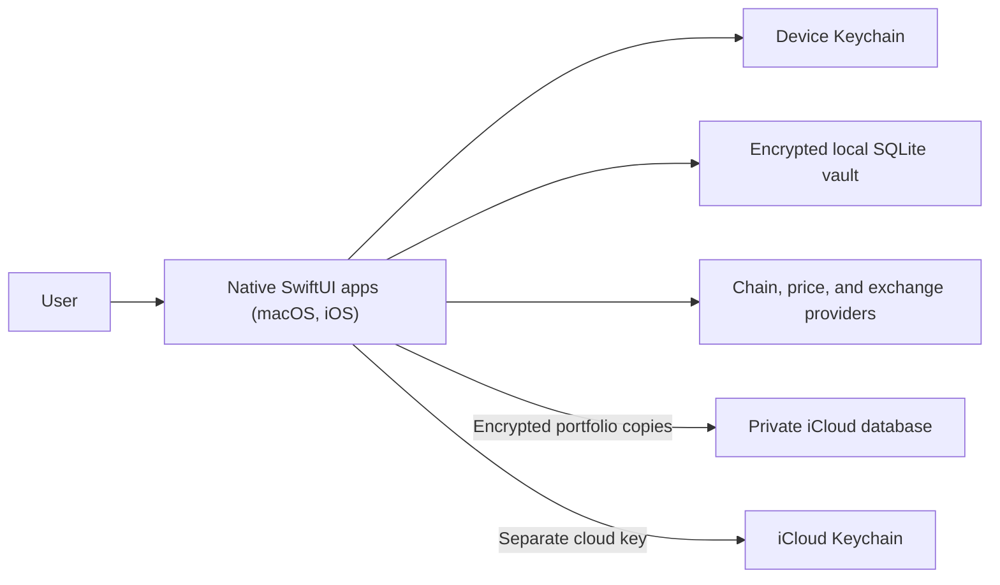

<p align="center">
  
</p>

<h1 align="center">Address Atlas</h1>

<p align="center">
  <strong>The private crypto portfolio tracker that sees what others miss.</strong><br>
  Wallets, exchanges, tokens, staking, and rewards in one encrypted native app for Mac, iPhone, and iPad.
</p>

<p align="center">
  <a href="https://github.com/girginomer10/address-atlas/actions/workflows/ci.yml"></a>
  
  
  
  <a href="LICENSE"></a>
</p>

Address Atlas is a local-first, read-only portfolio tracker for public wallet addresses and supported exchanges. It maps assets across **20 active networks** without taking custody, asking for a seed phrase, or requesting signing, trading, or withdrawal permission.

> [!IMPORTANT]
> Address Atlas is currently a **source-first preview**. There is no signed and notarized public download yet. Build it from source, and treat every result as portfolio visibility—not accounting-grade proof or financial advice. The iOS app is source-only as well: it has no TestFlight build, App Store record, or public download, and it has been exercised only on the simulator.

## Why Address Atlas

- **One map, more signal.** See native assets, registered tokens, exchange balances, Cosmos delegations, and rewards together.
- **Read-only by design.** Add public addresses or balance-only exchange credentials. Address Atlas never asks for private keys or seed phrases.
- **Private where it matters.** The portfolio vault is encrypted locally with a Keychain-backed key; only request data required by the providers you use leaves the app.
- **Honest about partial data.** Provider, token, staking, reward, trustline, price, and pagination failures remain visible instead of silently producing a false all-clear.
- **Optional iCloud copies.** Save and restore an encrypted portfolio in your own iCloud account. No Address Atlas account or backup server is required. Transfers are user initiated, not automatic merging.

## Current coverage

| Surface | Support |
| --- | --- |
| EVM | Ethereum, Base, Arbitrum One, Optimism, Polygon PoS, BNB Chain, Avalanche C-Chain, Gnosis Chain, Linea, Mantle, Scroll, ZKsync Era |
| Other networks | Bitcoin, Solana, TRON, XRP Ledger |
| Cosmos | Cosmos Hub, Osmosis, Celestia, Stride—including liquid, delegated, and reward balances |
| Tokens | Registered ERC-20, SPL, and TRC20 assets; positive XRPL issued-currency trustlines |
| Exchanges | Binance, Coinbase Advanced Trade, and Kraken through native read-only clients |
| Portfolio tools | USD pricing, BTC-relative fiat conversion, snapshots, dust filtering, partial-scan warnings, and CSV/JSON export |

The active network list comes from the native [chain registry](native/AddressAtlasMac/Sources/AddressAtlasCore/Scanners/ChainRegistry.swift). A provider failure can make coverage temporarily incomplete; Address Atlas surfaces that state in the scan result.

## Privacy model

Address Atlas does not pretend that querying a public blockchain is invisible. Its trust boundaries are explicit:

| Boundary | What it receives |
| --- | --- |
| Your device (Mac, iPhone, or iPad) | Plaintext portfolio data while the app is unlocked; the local SQLite vault stores one AES-256-GCM encrypted document |
| Device Keychain (macOS or iOS) | A random, this-device-only vault key |
| Chain RPC and REST providers | The public addresses and network requests needed to scan supported chains |
| Supported exchanges | Signed, read-only balance requests made directly by the native app |
| CoinGecko | Asset and fiat-rate lookup requests; no exchange credentials or vault snapshot |
| iCloud / CloudKit | Encrypted portfolio copies in your private database; a separate encryption key travels through iCloud Keychain |

The recommended **share-safer** CSV and JSON summaries omit addresses, labels, exact balances, and history in favor of coarse groups and ranges. They reduce disclosure but are not anonymous. Full identifying reports remain available behind an explicit warning and are not vault backups.

See [PRIVACY.md](PRIVACY.md) for the complete user-facing boundary and [.github/SECURITY.md](.github/SECURITY.md) for private vulnerability reporting.

## Architecture



- [`native/AddressAtlasMac`](native/AddressAtlasMac) is the macOS product and the home of the shared code: the `AddressAtlasCore` library (portfolio model, scanners, encryption, recovery, export, and iCloud client) plus the shared state layer and design system.
- [`native/AddressAtlasiOS`](native/AddressAtlasiOS) is the iOS app for iPhone and iPad. It compiles `AddressAtlasCore` and the shared state layer straight from the Mac package sources and adds only its own SwiftUI screens; see the [iOS app guide](native/AddressAtlasiOS/README.md).
- The root Next.js service and [`server/sync`](server/sync) are retained as legacy migration/reference code. The current Mac app does not use or require them.
- [`docs/ICLOUD.md`](docs/ICLOUD.md) describes provisioning, the private record schema, the two-device release test, and the iOS gates. Real iCloud transfer requires an Apple-signed, iCloud-enabled build.
- [`docs/DEVELOPMENT.md`](docs/DEVELOPMENT.md) records architectural invariants and the full verification gate.
- [`docs/OPERATIONS.md`](docs/OPERATIONS.md) and [`docs/RELEASE_CHECKLIST.md`](docs/RELEASE_CHECKLIST.md) cover production operations and signed distribution.

## Run the macOS app

Requirements: macOS 14 or newer and a Swift 5.10-compatible toolchain. Full Xcode is required for XCTest.

```bash
git clone https://github.com/girginomer10/address-atlas.git
cd address-atlas/native/AddressAtlasMac
./check-toolchain.sh
swift run AddressAtlasMac
```

To build a local universal app bundle:

```bash
./build-mac-app.sh
open "dist/Address Atlas.app"
```

Local builds use hardened runtime and ad-hoc signing by default. They are not public distribution artifacts. See the [native app guide](native/AddressAtlasMac/README.md) for signing, toolchain, storage, and packaging details.

## Run the iOS app

Requirements: full Xcode selected with `xcode-select` (Command Line Tools alone cannot build iOS apps; CI uses Xcode 26.5) and an iOS 17 or newer simulator. The generated Xcode project is committed, so `xcodegen` is only needed after editing `native/AddressAtlasiOS/project.yml`.

```bash
cd "$(git rev-parse --show-toplevel)"
npm run native:ios:build      # simulator build, Xcode ad-hoc signed so the Keychain works
npm run native:ios:run        # build, then install and launch on the booted simulator
npm run native:ios:generate   # only after editing project.yml; commit the regenerated project
```

Alternatively, open `native/AddressAtlasiOS/AddressAtlasiOS.xcodeproj` in Xcode and run the `AddressAtlasiOS` scheme on a simulator. The iOS app has no TestFlight build, App Store record, or public download, and no physical-device or signed build has been verified. See the [iOS app guide](native/AddressAtlasiOS/README.md) for versioning, signing, entitlements, and the shared-source layout.

## Run optional encrypted sync

The macOS app works locally without a sync server. To run the self-hostable development service, install Node.js `>=22.17 <23`, npm `>=10.9.2 <11`, and Docker with Compose:

```bash
cd "$(git rev-parse --show-toplevel)"
npm ci
install -m 0600 .env.example .env
node -e '
  const fs = require("node:fs"), crypto = require("node:crypto"), path = ".env";
  const source = fs.readFileSync(path, "utf8");
  fs.writeFileSync(path, source.replace(
    "replace-with-a-long-random-secret",
    crypto.randomBytes(32).toString("base64url"),
  ));
'
npm run sync:db:up
npm run dev
```

The setup creates `.env` with owner-only permissions and replaces the deliberately rejected session-secret placeholder before startup. Never reuse published placeholders or commit `.env`. Deployment, backup, restore, and monitoring procedures live in the [sync service guide](server/sync/README.md).

## Verify changes

Run the checks relevant to the area you changed. The complete local gate is documented in [Development Notes](docs/DEVELOPMENT.md).

```bash
# Web and sync service
npm test
npm run typecheck
npm run build

# Native app (requires full Xcode)
cd native/AddressAtlasMac
swift test

# Native iOS app (requires full Xcode; compile-only, no signing identity needed)
cd "$(git rev-parse --show-toplevel)"
npm run native:ios:build:unsigned
```

GitHub Actions also verifies repository hygiene, dependency security, server behavior, native tests, the iOS simulator build and bundle checks, production operations, and release governance.

## Built with OpenAI Codex and GPT-5.6

OpenAI Codex with GPT-5.6 was used as an engineering collaborator throughout Build Week—not as a runtime product feature.

- **Architecture and threat modeling:** challenged the local-first, read-only trust boundaries, exchange-permission policy, encrypted sync design, and failure modes before implementation.
- **Cross-stack implementation:** supported focused work across the native Swift/SwiftUI app and the optional Next.js, TypeScript, PostgreSQL, and passkey sync service.
- **Adversarial review:** searched for edge cases in multi-chain scanning, partial-result disclosure, encrypted-state recovery, exports, provider integrity, and accessibility.
- **Verification and hardening:** expanded regression tests, reviewed CI and release gates, and repeated security and repository-quality sweeps until confirmed findings were resolved.

Every suggested change remained subject to human review and repository tests. **Address Atlas has no OpenAI runtime dependency and does not send portfolio data to OpenAI.**

## Contributing

Start with [CONTRIBUTING.md](CONTRIBUTING.md), then open a focused issue or pull request. The core boundary is non-negotiable: no custody, no seed phrases, no signing, no trading, and no withdrawal permissions.

Security issues do not belong in public issues. Use [GitHub private vulnerability reporting](https://github.com/girginomer10/address-atlas/security/advisories/new).

## License

Address Atlas is available under the [MIT License](LICENSE).
