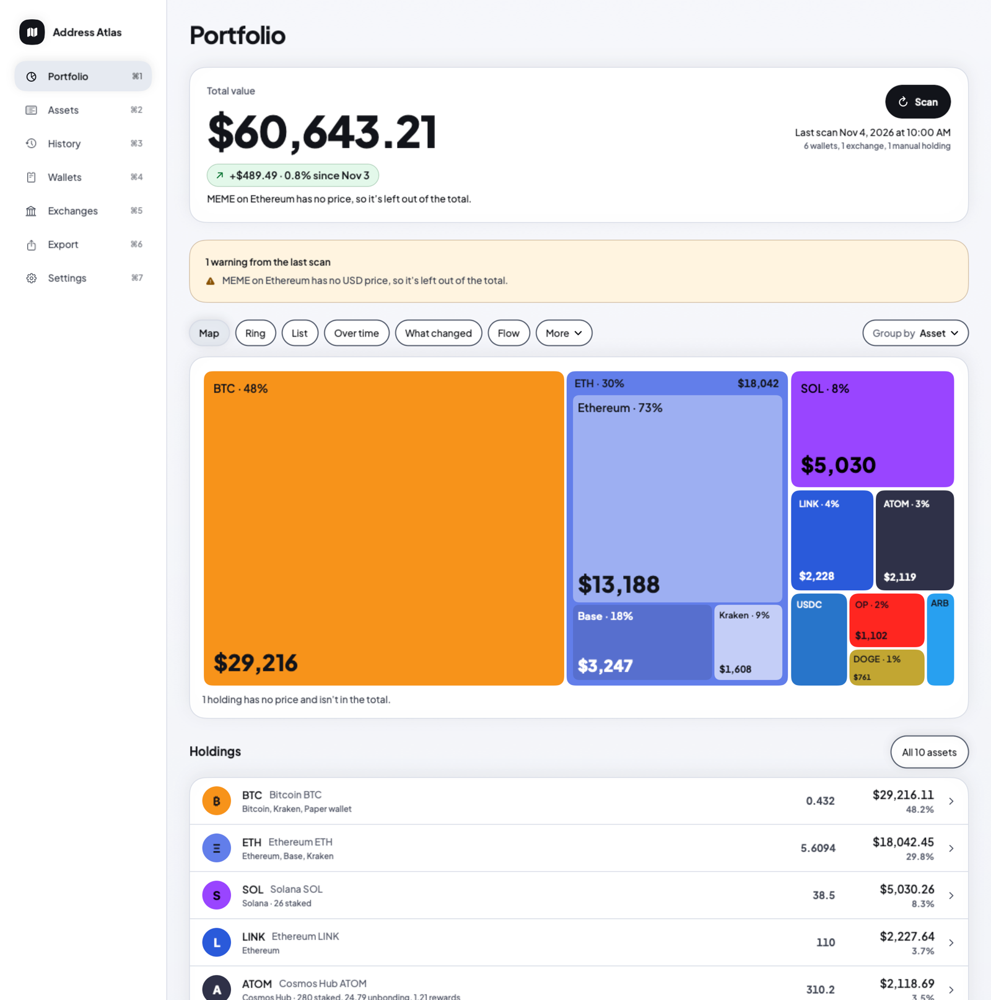
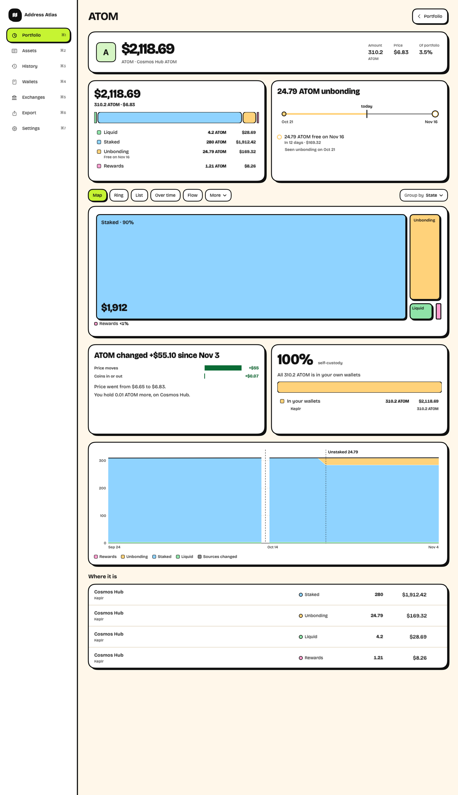
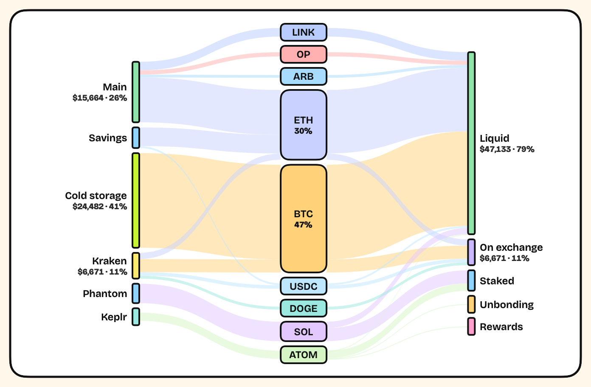
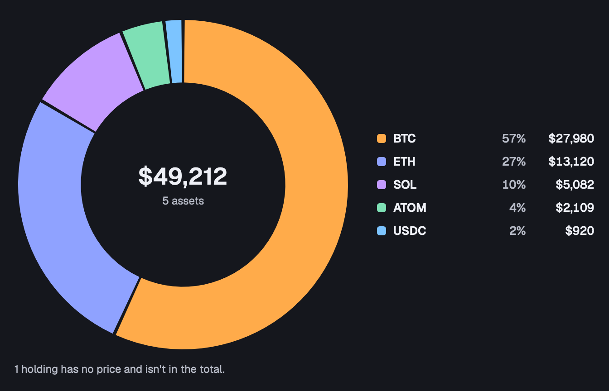

<p align="center">
  
</p>

<h1 align="center">Address Atlas</h1>

<p align="center">
  A read-only crypto portfolio for Mac and iPhone. Your data stays on your devices.
</p>

<p align="center">
  <a href="https://github.com/girginomer10/address-atlas/actions/workflows/ci.yml"></a>
  
  
  
  <a href="LICENSE"></a>
</p>

Add public wallet addresses and read-only exchange API keys. Address Atlas reads balances and tokens on 20 networks, plus staking and unbonding on Cosmos chains and Solana and rewards on Cosmos chains. It adds USD prices and shows the result in 14 views and six themes. It never asks for a seed phrase and never needs permission to sign, trade, or withdraw.

Balances are read directly from public chain, price, and exchange providers, so those providers see the addresses you scan. See [Privacy](#privacy).

> [!IMPORTANT]
> Address Atlas is a preview. You can build it from source. There is no signed and notarized public download yet; the [release checkpoint](app-store/README.md#release-checkpoint--october-6-2026) lists the macOS and iOS TestFlight builds. Treat results as a view of your holdings, not as accounting records or financial advice. Physical-device acceptance and Mac-to-iPhone iCloud restore are not verified.

## Screenshots

Rendered from a synthetic portfolio.

| Portfolio, Chain colours | Coin detail, Candy brutal |
| --- | --- |
|  |  |

| Flow, Candy brutal | Ring, Heatmap (dark) |
| --- | --- |
|  |  |

<!-- TODO(phase3): add iPhone screenshots (docs/design/screenshots/phase3/ios/) once the iOS screens are rebuilt -->

## What you get

### Six themes

Chain colours, Candy brutal, Riso zine, Heatmap, Pixel, and Acid. Choose one in **Settings → Theme**; the app restyles without a relaunch. Riso zine is light only and Acid is dark only. The other four follow light and dark mode. Previews are in [`docs/design/themes.html`](docs/design/themes.html).

### 14 views

Every view works with every theme. Most take a **group by** choice: Asset, Network, Wallet or exchange, State, or Type. State is liquid, staked, unbonding, rewards, or on an exchange.

| View | Shows |
| --- | --- |
| Map | Treemap. Each block's area is its share of the portfolio. |
| Ring | Donut with the total in the middle and a legend. |
| Strip | One bar split by share. |
| Grid | 100 squares, one per percent. |
| Bubbles | Circles sized by value. |
| Rings in rings | Two rings. The outer ring splits each inner slice by a second grouping. |
| List | One row per slice, largest first, with share and value. Coins without a price come last. |
| Flow | Wallets and exchanges on the left, coins in the middle, states on the right. |
| Atlas map | Voronoi map. Each cell's area is its value. |
| Over time | Value across your saved scans, stacked by group. |
| What changed | The change between the latest two scans, split into price moves and coins arriving or leaving. |
| Slope | Each coin's rank in an earlier scan and now. |
| Concentration | How much sits in the largest group, and how many equal-sized holdings the portfolio behaves like. |
| Calendar | One square per day, green or red by that day's change. Days without a scan stay empty. |

The history views (Over time, What changed, Slope, Calendar) need saved scans. When two scans read different wallets or exchanges, these views cut the chart, mark the break, or say the comparison is not like for like.

### Coin widgets

Open a coin to see:

- **State strip**: how much is liquid, staked, unbonding, rewards, or on an exchange.
- **Unlock timeline**: when unbonding amounts become spendable.
- **Amount history**: the coin amount, not the dollar value, across saved scans.
- **Change**: why the coin's value moved since the last comparable scan, price or coins.
- **Custody**: how much you hold yourself and how much sits on exchanges.

### Also included

USD pricing, BTC-relative fiat conversion, snapshots, dust filtering, CSV and JSON export, and a recovery kit for restoring on a new device. If a provider fails, the scan keeps what it read and shows a warning. It does not report a partial result as complete.

## Coverage

20 networks, from the native [chain registry](native/AddressAtlasMac/Sources/AddressAtlasCore/Scanners/ChainRegistry.swift).

| Source | What is read |
| --- | --- |
| **EVM:** Ethereum, Base, Arbitrum One, Optimism, Polygon PoS, BNB Chain, Avalanche C-Chain, Gnosis Chain, Linea, Mantle, Scroll, ZKsync Era | Native balance and registered ERC-20 tokens |
| **Bitcoin** | Native balance |
| **Solana** | SOL, registered SPL tokens, and stake accounts |
| **TRON** | TRX and registered TRC20 tokens |
| **XRP Ledger** | XRP and positive issued-currency trustlines |
| **Cosmos:** Cosmos Hub, Osmosis, Celestia, Stride | Liquid, delegated (staked), unbonding, and claimable reward balances in the chain's own coin |
| **Exchanges:** Binance, Coinbase Advanced Trade, Kraken | Account balances only, through read-only API keys |

You can add custom ERC-20, SPL, and TRC20 tokens. Up to 100 enabled custom tokens are scanned.

**Unbonding and stake accounts**

- **Cosmos:** unbonding delegations are read with their completion time. Each distinct completion time becomes its own holding, so a holding's unlock date is exact for its whole amount. Past 20 distinct times, the later ones are combined under the earliest of their dates, with a warning. An entry without a usable completion time is counted without a date, with a warning.
- **Solana:** stake accounts are read with `getProgramAccounts` and classified by the current epoch. Active and activating stake counts as staked. Stake that is cooling down counts as unbonding, with no unlock date because Solana does not publish one. Stake that has finished cooling down but is not withdrawn yet counts as staked, with a warning. Only accounts your address can withdraw are counted.
- Many free Solana RPC endpoints reject `getProgramAccounts`. The scan then warns that staked and unbonding SOL may be missing and still returns your SOL balance and tokens.

## Try it with a public wallet

You need macOS 14 or newer, full Xcode installed and opened once, and an internet connection. No account, exchange API key, Node.js, Docker, or iCloud setup is needed.

1. Run `xcodebuild -version`. If it reports Command Line Tools, select Xcode in **Xcode → Settings → Locations → Command Line Tools** and try again.
2. Build and open the app:

   ```bash
   git clone https://github.com/girginomer10/address-atlas.git
   cd address-atlas/native/AddressAtlasMac
   ./check-toolchain.sh
   ./build-mac-app.sh
   open "dist/Address Atlas.app"
   ```

3. Open **Wallets**, paste this public Bitcoin address, and choose **Add wallet**:

   ```text
   1A1zP1eP5QGefi2DMPTfTL5SLmv7DivfNa
   ```

4. Open **Portfolio** and choose **Scan all sources**. When it finishes, open **Assets** and search for **BTC**. You should see a Bitcoin holding. Balances and prices change with live provider data. If a provider is unavailable, the app shows a warning; scan again later.
5. Close and reopen the app. The wallet and snapshot should still be there. You can remove the wallet in **Wallets** and the snapshot in **Snapshots**.

This is a local build with an ad-hoc signature. For iPhone, see [Build and run](#build-and-run).

## Privacy

Address Atlas is not anonymous. Reading a public blockchain means asking a provider about an address.

| Who | What they get |
| --- | --- |
| Your device (Mac, iPhone, or iPad) | Your portfolio, saved as one AES-256-GCM encrypted document in a local SQLite database |
| Device Keychain | The random encryption key, stored so that it stays on this device |
| Chain RPC and REST providers | The public addresses and requests needed to scan |
| Exchanges | Signed, read-only balance requests, sent directly from the app |
| CoinGecko | Asset and fiat-rate lookups. No exchange API keys and no portfolio data. |
| iCloud (CloudKit) | If you save a copy: an encrypted copy of the portfolio in your private database. A second key travels through iCloud Keychain. |

There is no Address Atlas account and no Address Atlas backup server. iCloud transfers are manual: you save and restore, and nothing merges in the background.

Share-safer CSV and JSON exports leave out addresses, labels, exact balances, and history, and group the rest into ranges. They show less but are not anonymous. Full exports include all of it, behind a warning. Neither kind is a portfolio backup.

Full details are in [PRIVACY.md](PRIVACY.md). Report vulnerabilities privately; see [.github/SECURITY.md](.github/SECURITY.md).

## Project layout

- [`native/AddressAtlasMac`](native/AddressAtlasMac) is the macOS app. It also holds `AddressAtlasCore` (portfolio model, scanners, encryption, recovery, export, iCloud client) and the shared state layer, design system, themes, and charts.
- [`native/AddressAtlasiOS`](native/AddressAtlasiOS) is the iPhone and iPad app. It compiles `AddressAtlasCore` and the shared sources from the Mac package and adds its own screens. See the [iOS app guide](native/AddressAtlasiOS/README.md).
- [`docs/design`](docs/design) holds the theme and view references and the screenshots above.
- The root Next.js service and [`server/sync`](server/sync) are older sync code. The apps no longer use them. See [Legacy sync service](#legacy-sync-service).
- [`docs/ICLOUD.md`](docs/ICLOUD.md): iCloud setup, the private record schema, and the two-device release test. Real iCloud transfer needs an Apple-signed build with iCloud enabled.
- [`docs/DEVELOPMENT.md`](docs/DEVELOPMENT.md): architecture rules and the full verification gate.
- [`docs/OPERATIONS.md`](docs/OPERATIONS.md) and [`docs/RELEASE_CHECKLIST.md`](docs/RELEASE_CHECKLIST.md): operations and signed releases.

## Build and run

### Mac

You need macOS 14 or newer and a Swift 5.10 toolchain. XCTest needs full Xcode.

```bash
cd native/AddressAtlasMac
./check-toolchain.sh
swift run AddressAtlasMac
```

To build a universal app bundle:

```bash
./build-mac-app.sh
open "dist/Address Atlas.app"
```

Local builds use the hardened runtime and an ad-hoc signature. They are not for distribution. The [Mac app guide](native/AddressAtlasMac/README.md) covers signing, storage, and packaging.

### iPhone and iPad

You need full Xcode selected with `xcode-select` and an iOS 17 or newer simulator. Command Line Tools cannot build iOS apps. CI uses Xcode 26.5. The Xcode project is committed, so `xcodegen` is only needed after editing `native/AddressAtlasiOS/project.yml`.

Open the project, select the **AddressAtlasiOS** scheme and an iPhone simulator, and run:

```bash
open native/AddressAtlasiOS/AddressAtlasiOS.xcodeproj
```

After onboarding, add the example address above, open **Portfolio**, and tap **Scan now**. Wallets and scans work without iCloud.

From Terminal, boot a simulator first, then:

```bash
./native/AddressAtlasiOS/build-ios-app.sh --simulator --install-booted
```

This builds, installs, and launches on the booted simulator with the ad-hoc signature that local Keychain access needs. `--unsigned` only checks that the code compiles; an unsigned build cannot unlock the local portfolio. The `npm run native:ios:*` scripts do the same for contributors. Node.js is not needed for either app.

The iOS App Store Connect record exists; build and TestFlight evidence is in the [release checkpoint](app-store/README.md#release-checkpoint--october-6-2026). Physical-device acceptance is not verified. The [iOS app guide](native/AddressAtlasiOS/README.md) covers versioning, signing, and entitlements.

### Test

The full local gate is in [Development Notes](docs/DEVELOPMENT.md). Run the part that matches your change:

```bash
# Native Mac app (needs full Xcode)
cd native/AddressAtlasMac
swift test

# Native iOS app (needs full Xcode; compile only, no signing identity)
cd "$(git rev-parse --show-toplevel)"
npm run native:ios:build:unsigned

# Web and sync service
npm test
npm run typecheck
npm run build
```

GitHub Actions also checks repository hygiene, dependency security, server behavior, native tests, the iOS simulator build and bundle, production operations, and release rules.

## Legacy sync service

The apps no longer connect to the root Next.js service or [`server/sync`](server/sync). It is a self-hostable service for passkey sync accounts and encrypted portfolio snapshots, kept for reference and for older data. To run it you need Node.js `>=22.17 <23`, npm `>=10.9.2 <11`, and Docker with Compose:

```bash
cd "$(git rev-parse --show-toplevel)"
npm ci
install -m 0600 .env.example .env
node -e '
  const fs = require("node:fs"), crypto = require("node:crypto"), path = ".env";
  const source = fs.readFileSync(path, "utf8");
  fs.writeFileSync(path, source.replace(
    "replace-with-a-long-random-secret",
    crypto.randomBytes(32).toString("base64url"),
  ));
'
npm run sync:db:up
npm run dev
```

This creates `.env` with owner-only permissions and replaces the session-secret placeholder, which the service rejects. Do not reuse published placeholders or commit `.env`. Deploy, backup, restore, and monitoring steps are in the [sync service guide](server/sync/README.md).

## Built with OpenAI Codex and GPT-5.6

OpenAI Codex with GPT-5.6 was an engineering collaborator during Build Week. It is not part of the app.

- **Architecture and threat modeling:** challenged the read-only boundaries, the exchange-permission policy, the encrypted sync design, and failure modes before implementation.
- **Implementation:** helped with the native Swift and SwiftUI apps and the Next.js, TypeScript, PostgreSQL, and passkey sync service.
- **Adversarial review:** looked for edge cases in multi-chain scanning, partial results, encrypted-state recovery, exports, provider integrity, and accessibility.
- **Verification:** expanded regression tests, reviewed CI and release gates, and repeated security and repository sweeps until confirmed findings were fixed.

A human reviewed every suggested change, and the repository tests run on all of it. Address Atlas has no OpenAI runtime dependency and does not send portfolio data to OpenAI.

## Contributing

Start with [CONTRIBUTING.md](CONTRIBUTING.md), then open a focused issue or pull request. The boundary does not change: no custody, no seed phrases, no signing, no trading, no withdrawal permissions.

Do not report security issues in public issues. Use [GitHub private vulnerability reporting](https://github.com/girginomer10/address-atlas/security/advisories/new). For help, see [SUPPORT.md](SUPPORT.md).

## License

[MIT](LICENSE). The native apps bundle fonts under the SIL Open Font License; see [THIRD-PARTY-NOTICES.md](THIRD-PARTY-NOTICES.md).
